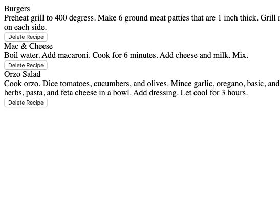

# Deleting Data
Date Created: 01/31/20 | Date Modified: 01/31/20

*This assignment is practice for Book 3: Chapter 7 of NSS's course work. Link to the assignment: https://github.com/TrinityTerry/client-side-mastery/blob/master/book-3-the-initiate/chapters/DELETE_DATA.md*

Preview assignment here: https://trinity-delete-data.netlify.com/
***
This assignment uses the DELETE verb to delete data in an API

